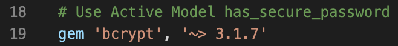
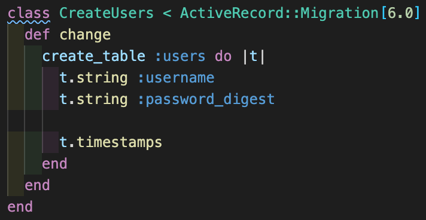
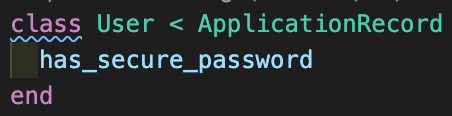

# Auth^2 with Rails

## Secure User Authentication using bcrypt

When we create an app that is going to store information about different users, or as we begin to create proteected resources on our backend, it becomes espcially important to authenticate users with a username and password when they visit our app. We could easily just store that information directly in the backend and then call a GET request when a user logs in, but that wouldn't be secure or a very good practice in general. Instead, we POST login requests and use tools like bcrypt and JWT to store and compare user data. Below we'll go through the process of storing user login information and authenticating a user in a Rails API backend.

## Setting up the Rails API

After you set up your API with `rails new --api your-api-name` we need to enable some additional functionality with gems. The first thing we need to do to securely store login information is install or enable the **bcrypt gem**.

It should already be in your gemfile, you will just need to uncomment it and run `bundle install` in your terminal. Bcrypt enables some secure hashing functionality in Rails which we will use to store a secure substitute for the user's password. [Cryptographic hashing](https://en.wikipedia.org/wiki/Cryptographic_hash_function) is an algorithmic, one-way transformation of information, resulting in a unique, fixed-length number[^1]. The TL;DR is that bcrypt takes the password string input, adds a little extra bit of information called "salt," chops everything up and mixes it around (like **hash** browns...), and then spits out a very random string of numbers (usually not in base-10) which includes some information that lets bcrypt compare the hash with a later password input. Got it? Good thing bcrypt takes care of hashing behind the scenes for us, huh?

## Generating a User with a secure password

With Rails and the bcrypt gem, it's very simple to create a user and store their password as a hash. First create a user model using `rails g model user username password`. Next we update the users database migration to change `:password` to `:password_digest`, and the User model to include `has_secure_password` at the top of the class.

 

These two things tells our Rails database "Hey - don't use the password the user sent us! Hash it with bcrypt first!" Now, when we send a request to either create a new user or log an existing user in, Rails will know to take the password and hash it before storing it or trying to compare it to a saved hash. If you looked at a "password" after it had been saved, you would just see the random string generated by hashing it.

## Up Next

That's it! We've now created a secure way of storing passwords in a Rails backend using bcrypt. In part two we'll look at how to use the secure password we've just created (along with JWT, tokens, and local storage) to log a user in and then check to make sure they're logged in before performing other actions.

[^1]: In extrememly rare cases, a hash function can return the same number result for two different inputs. This is called a "hash collision," and one of the primary considerations for a hashing function is how easily there might be a collision.
