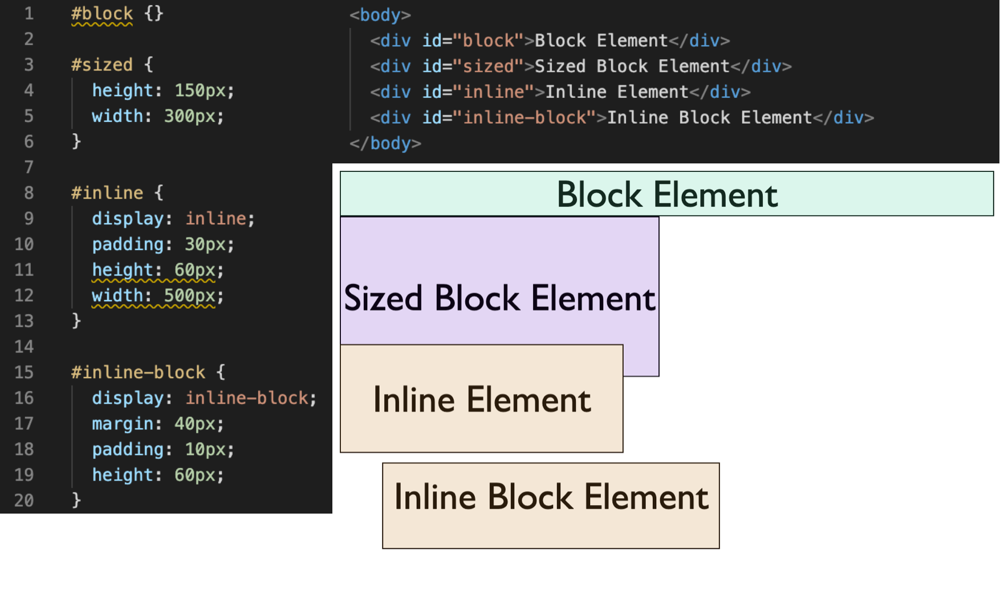
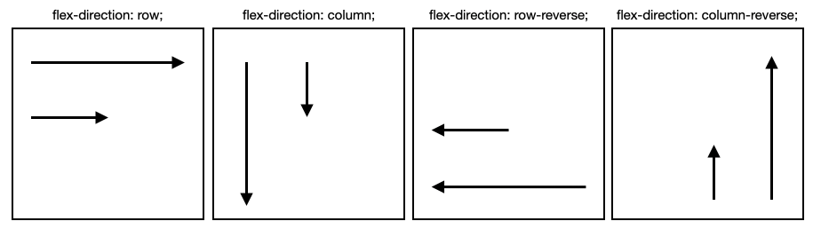

# Display Basics With Flexbox

Being able to make elements of a page display where you want them to is an incredibly important aspect of the design and production of web apps. Back in the old days of the web, it wasn’t easy to play with how elements displayed relative to one another on a page - we had block elements and inline elements, and good luck getting them to do interesting things. Thankfully we’ve come a long way and introduced functionality like flexbox into CSS, which makes styling and arranging elements much easier.

## Display Block vs. Display Inline

There are 2 main ways elements on the page are formatted for display - block and inline. Before getting into flexbox specifically, it’s important to understand the difference between these display types. As you can see below, block elements inherently take up the entire width of the container they’re in, forcing elements before and after onto new lines. Block elements can also be sized by giving specific values for the height and width.

But what's going on with those inline elements? The first thing to note is that Inline elements take up only the space of their content and cannot be given width or height values. Inline elements can be given padding and margin, but notice that the padding given to the inline element doesn't actually move it away from the above block element - the inline element simply pushes its padding over the block element. Also note that inline elements can only apply margin to the left and right because they can still stay in the flow of the line while moving things left and right.

Inline block elements combine some features of both block elements and inline elements. Inline block elements can be given height, width, padding, and margin - all of which act like you would expect on a block element. The biggest difference here is that inline-block elements won't force items to a new line, so you can put multiple inline block elements next to eachother.

## Flexbox Introduction

### History of Flexbox

The CSS Flexible Box Layout (AKA flexbox) was released with CSS3 as a way to solve many of the problems developers had with the contstraints on element positioning. Flexbox allows us to create flex containers to place elements in, and then dynamically adjust the layout of each container's children elements, also known as flex items. Containers and their elements can be adjusted responsively to adapt to different display sizes as well as different page renderings.

### Important Terminology

- **Flex Container** – This is the parent element which holds flex items
  - ``display: flex`` - Creates a block style flex container
  - ``dixplay: inline-flex`` - Creates an inline style flex container
- **Flex Item** – All direct children of a flex container. Note that flex items can be flex containers themselves, containing other flex elements.
- **flex-direction** – Sets the **main flex axis** display style
  - ``row, column, row-reverse, column-reverse``

*As you can see, the flex direction controls not just in which direction the content flows, but also changes where the starting point is for elements to spawn. It's also going to be important to remember that the flex direction sets the main axis of movement, and that we will also have control over how elements behave along the cross axis*

- **justify-content** – Sets how flex items are aligned/spaced along the **main axis** inside the container
- **align-items** - Sets how flex items are aligned/spaced along the **cross axis** inside the container
- **flex-wrap** - Sets whether content is forced onto one line or is able to wrap onto multiple lines

## Flexbox 

### Justify Content

As mentioned earlier, ``justify-content`` allows you to set how flex items are aligned and spaced along the main axis. There are five possible values you can assign to justify content:

- ``flex-start`` - aligns items to the beginning of the flex container. See the flex-direction examples to understand where items will start spawning.
- ``flex-end`` - aligns items to the end of the flex container
- ``center`` - aligns items in the center of the flex container
- ``space-between`` - evenly spaces flex items within the container, pushing elements to the edge of the container
- ``space-around`` - also evenly spaces flex items, but leaves space between outer elements and the edge of the container

### Align Items

The ``align-items`` setting allows you to control how content is spaced and aligned along the **cross axis**, or 90° from the axis set by ``flex-direction`` when items are in a single row. So if your ``flex-direction`` is set to row (flexing the content horizontally) ``align-items`` would set the **vertical** spacing and alignment. There are five values you can assign to ``justify-content``, and three are the same as ``justify-content``:

- ``flex-start`` - aligns items to the beginning of the flex container 90° from the axis set by ``flex-direction``
- ``flex-end`` - aligns items to the end of the flex container 90° from the axis set by ``flex-direction``
- ``center`` - aligns items in the center of the flex container 90° from the axis set by ``flex-direction``
- ``baseline`` - aligns items along the baseline of text in the flex items
- ``stretch`` - stretches the flex item to fill the entire space available along the cross axis

### Align Content

While ``align-items`` is useful when the flex items live on a single row along the main axis, if the content displays across multiple lines, ``align-content`` will take care of arranging and spacing out those lines. There are six possible values for ``align-content``:

- ``flex-start`` - aligns lines to the beginning of the flex container without space between
- ``flex-end`` - aligns lines to the end of the flex container without space between
- ``center`` - aligns lines in the center of the flex container without space between
- ``space-between`` - evenly spaces lines within the container, pushing elements to the edge of the container
- ``space-around`` - evenly spaces lines, but also leaves space between outer elements and the edge of the container
- ``stretch`` - aligns the first line to the start of the container and adds even spacing **under** each line

You can use the codepen.io example below to see how different values passed into ``justify-content`` and ``align-items`` or ``align-content`` will change the display.

<https://codepen.io/btken88/pen/zYrNvLa>

### Flex Wrap

There are three possible values for ``flex-wrap``, which determines whether content displays in a single row or whether content is able to wrap onto multiple rows.

- ``nowrap`` - Forces all flex-items onto a single row. This is the default setting for flex-containers
- ``wrap`` - Wraps overflowing content onto consecutive lines in the normal flex-direction
- ``wrap-reverse`` - Wraps overflowing content reversed from the flex-direction. This will make your container with ``flex-direction: row`` display like it was given ``flex-direction: row-reverse``

### Align Self

The ``align-self`` property can be given to **flex items** to change that specific element's alignment on the page. This property accepts the same values as ``align-items``, and only changes that one flex item's position.

### Order

You can assign flex items an ``order`` property, which will adjust how flex items display in relation to **other flex items** within the parent container. A flex item is automatically assigned an ``order`` value of ``0``, and changing the value will cause that item to appear either before (lower order value) or after (higher order value) other flex items depending on their relative ``order`` values.

### Flex Grow and Shrink

It is possible to have flex items dynamically change size depending on whether or not the flex container is full along its axes. Giving a property of ``flex-grow`` or ``flex-shrink`` takes a value of a positive number, and grows or shrinks the flex item relative to other flex items based on the value provided. So if all items in a flex container have a ``flex-grow`` value of one, but one item is given a ``flex-grow`` value of two, it will be twice as large as the rest of the flex items in that container.

### Flex Basis

A flex item's ``flex-basis`` property sets the default size a flex item will take up before other space in the container is distributed. You can use standard CSS lengths, both absolute and regular, to set the size, or can use keywords like ``auto``, ``fill``, ``fit-content``, etc.

### Flex Flow

This is a simple shortcut to assign both a ``flex-direction`` and ``flex-wrap`` value to a flex container in one line.

- ``flex-flow: flex-direction-value flex-wrap-value``

### Flex

The ``flex`` property is a shortcut you can use to assign multiple properties to a flex item. ``Flex`` allows you to set the ``flex-grow``, ``flex-shrink`` and ``flex-basis`` together. The only required parameter is ``flex-grow``

- ``flex: flex-grow-value flex-shrink-value flex-basis-value``
- Default values are ``flex: 0 1 auto``

